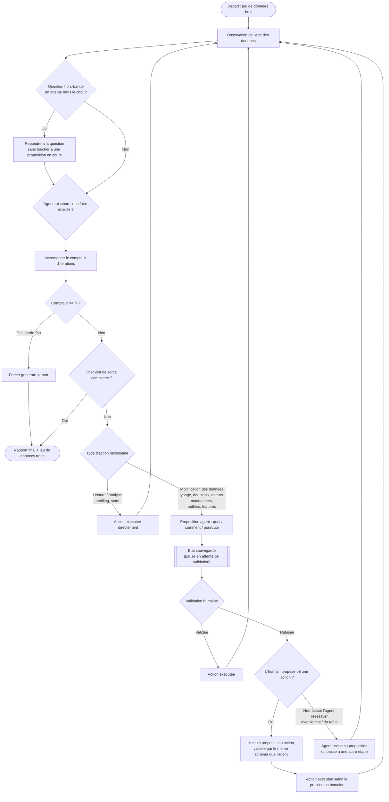

# AutoPrep Agent — Architecture

Document remis à terme à Claude Code pour implémentation. Conçu par Olivier (architecte), documenté par Claude au fil des échanges.

## Besoin principal (validé par Olivier le 2026-09-09)

Un agent IA opérationnel qui **décide seul des étapes à suivre et appelle les outils en conséquence**, par opposition à un pipeline écrit à l'avance qui exécute toujours la même séquence figée. C'est la différence fondamentale entre un script et un agent : un script suit un chemin décidé au moment où on l'écrit ; un agent observe l'état réel des données à chaque étape et choisit son prochain geste en fonction de ce qu'il observe.

**Contrainte non négociable : validation humaine avant chaque modification.** Avant toute action qui modifie les données (nettoyage, transformation, suppression, feature engineering), l'agent ne l'exécute pas directement — il propose : **quoi** il veut faire, **comment** il compte le faire, et **pourquoi** (le raisonnement qui l'a mené à cette proposition). L'humain valide ou non avant que l'action soit exécutée.

Point à confirmer avec toi : je pars du principe que cette validation s'applique aux actions qui **modifient** les données (nettoyage, suppression, transformation), et que les actions de pure lecture/analyse (profiling, calcul de statistiques, réponse à une question sur les données) s'exécutent librement sans demander l'aval — parce que ce sont les actions de modification qui posent un risque, pas la lecture. Dis-moi si c'est bien ta lecture ou si tu veux un aval systématique sur absolument tout, y compris la lecture.

## Boucle de décision de l'agent (proposition de design)



Ce schéma reprend le pattern connu sous le nom de **boucle ReAct** (Reasoning + Acting), avec une porte de validation humaine ajoutée avant les actions à risque — un pattern courant appelé **human-in-the-loop (HITL)**.

**Mise à jour du 2026-09-09 — trois corrections d'Olivier, toutes retenues :**

1. **Entrée hors-bande pour les questions.** Une question peut arriver à tout moment, y compris pendant qu'une proposition attend une validation. Le nœud `CheckMsg` la détecte en tout début de cycle et l'agent y répond avant de reprendre son plan — sans perturber une proposition déjà en attente (si `Pause` est actif, il reste actif après la réponse).
2. **Garde-fou anti-boucle-infinie.** Un compteur d'itérations vit dans l'état partagé. Au-delà de N boucles, l'agent est forcé de produire son rapport et de s'arrêter, plutôt que de tourner indéfiniment (et de consommer des tokens API pour rien). N reste à définir (proposition : commencer à 15-20 et ajuster en testant).
3. **Persistance de la validation humaine.** Un `input()` bloquant ne fonctionne pas avec le modèle d'exécution de Streamlit, qui ré-exécute tout le script à chaque interaction plutôt que de dérouler une boucle Python continue. Le nœud `Pause` représente ça concrètement : dès qu'une proposition est formulée, son contenu est écrit dans `st.session_state` (pas dans une variable locale qui disparaîtrait au prochain rerun). Sur chaque rerun suivant, l'app vérifie s'il y a une proposition en attente dans `st.session_state` ; si oui, elle l'affiche avec ses boutons Valider/Refuser au lieu de relancer le raisonnement. Une fois la réponse humaine capturée, elle est aussi écrite dans l'état, et le "graphe" reprend sa marche à partir de là. C'est le même principe que le mécanisme `interrupt` de LangGraph que tu mentionnes, mais fait à la main avec les outils de Streamlit plutôt qu'avec ce framework — cohérent avec la décision initiale de coder la boucle d'agent soi-même. Si tu préfères t'appuyer sur LangGraph pour obtenir cette persistance nativement (au prix d'apprendre son API en plus, dans un planning déjà serré), dis-le-moi et on révise la stack.

En cas de refus d'une proposition, l'humain peut proposer lui-même une action plutôt que de laisser l'agent réessayer seul (pattern **steering**) : l'agent garde l'initiative par défaut, mais l'humain peut reprendre la main sur une étape précise sans interrompre toute la boucle.

**Deuxième passe de corrections (2026-09-09) :**
- Le compteur d'itérations s'incrémente désormais à chaque passage par `Thought` (une itération = un cycle de raisonnement), pas seulement quand une action est exécutée — sinon une succession de lectures ne serait jamais comptée et le garde-fou serait moins fiable. Confirmé le 2026-09-09 : l'incrémentation compte uniquement l'exécution du nœud `think`, jamais le temps passé en pause sur l'`interrupt` de validation — sinon le garde-fou mettrait un temps disproportionné à se déclencher et gonflerait inutilement le coût en tokens d'attente. **N = 15**, en dur dans `config.py` : un nettoyage complet prend ~8-12 passages sur `think`, 15 laisse la marge pour une ou deux révisions tout en se déclenchant assez vite pour une démo. Le déclenchement du garde-fou n'est pas une erreur silencieuse : il s'affiche dans le chat comme un chemin normal du graphe — `"Itération maximale atteinte (15) — je génère le rapport avec l'état actuel."`
- La condition de fin n'est plus un jugement flou de l'agent ("tâche jugée terminée") mais une **checklist de sortie explicite**, détaillée dans le prompt système ci-dessous.
- La contre-proposition humaine passe désormais par la même validation de schéma que les appels de l'agent, pour éviter d'exécuter une action mal formée (colonne inexistante, stratégie invalide) simplement parce qu'un humain l'a tapée.
- Le refus peut maintenant porter un motif (`motif_refus`), transmis à l'agent pour qu'il propose une alternative pertinente plutôt que de tâtonner à l'aveugle.

## Concepts clés (pour comprendre le fonctionnement, pas juste l'implémenter)

**Agent vs pipeline.** Un pipeline classique (ce que tu as fait dans PredAttrition_Ethic ou INS KPI Predictor) exécute une séquence d'étapes écrite à l'avance : étape 1, puis 2, puis 3, toujours dans le même ordre, quel que soit le contenu réel des données. Un agent, au contraire, observe l'état réel à chaque étape et un LLM décide dynamiquement quelle étape faire ensuite — il peut sauter une étape non nécessaire, en répéter une, ou en choisir une que tu n'avais pas prévue explicitement dans le code.

**Tool calling / function calling.** C'est le mécanisme technique qui permet au LLM d'agir sur le monde réel plutôt que de seulement produire du texte. Tu décris chaque fonction Python disponible (son nom, ce qu'elle fait, les paramètres qu'elle attend) dans un format que le LLM comprend. Quand tu lui envoies un message, le LLM peut répondre soit par du texte, soit en demandant à appeler une de ces fonctions avec des paramètres précis. Ton code exécute alors réellement la fonction, et renvoie le résultat au LLM pour qu'il continue son raisonnement. Le LLM ne code jamais rien lui-même à l'exécution — il choisit parmi les outils que tu lui as donnés.

**La boucle ReAct (Reasoning + Acting).** Popularisée par un papier de recherche de 2022 (Yao et al.), c'est le schéma dans lequel le LLM alterne explicitement entre "je réfléchis à ce qu'il faut faire" (Thought), "j'agis" (Action, un appel d'outil), et "j'observe le résultat" (Observation), en boucle, jusqu'à juger la tâche terminée. C'est ce schéma que ton besoin de "décider seul des étapes" implémente.

**Human-in-the-loop (HITL).** Un agent entièrement autonome exécute ses décisions sans repasser par un humain. Un agent HITL s'arrête à des points définis (ici : avant toute modification des données) pour demander une validation avant de continuer. C'est un compromis délibéré entre autonomie et contrôle — pertinent quand les actions ont un coût si elles sont mauvaises (ici : abîmer les données d'un client SCIO serait grave).

**Mémoire / contexte de l'agent.** Le LLM ne se souvient de rien entre deux appels API — c'est toi (ton code) qui dois lui renvoyer, à chaque tour, l'historique complet de la conversation (les Thought/Action/Observation précédents) pour qu'il ait le contexte nécessaire pour continuer à raisonner correctement.

## Sources pour approfondir

- [Building Effective AI Agents — Anthropic](https://www.anthropic.com/research/building-effective-agents) — la référence pour comprendre quand un agent est justifié par rapport à un simple pipeline, et les patterns de base (routing, orchestrateur-workers, evaluator-optimizer).
- [Writing effective tools for AI agents — Anthropic](https://www.anthropic.com/engineering/writing-tools-for-agents) — comment bien concevoir les outils qu'un agent va appeler, directement pertinent pour la conception des tools d'AutoPrep Agent.
- [Tool use avec Claude — documentation officielle](https://platform.claude.com/docs/en/agents-and-tools/tool-use/overview) — la mécanique technique exacte du tool calling que l'on va implémenter.
- [ReAct: Synergizing Reasoning and Acting in Language Models (Yao et al., 2022)](https://arxiv.org/abs/2210.03629) — le papier de recherche qui a formalisé la boucle Thought/Action/Observation.
- [The Human-in-the-Loop (HITL) Pattern — LiveKit](https://livekit.com/blog/human-in-the-loop-voice-agents) — bonne explication du pattern HITL, même si l'article est écrit pour des agents vocaux, le principe (points d'arrêt pour validation) est identique.

## Prérequis techniques

**Compte et clé API (LLM avec tool calling).** Recommandation : Anthropic (Claude), dont le tool use est natif et bien documenté pour ce cas d'usage — à valider ou remplacer par OpenAI si tu as une préférence ou un compte déjà en place.
- Modèle recommandé pour le développement : **Claude Haiku 4.5** — 1 \$ / million de tokens en entrée, 5 \$ / million en sortie. Largement suffisant pour orchestrer les appels d'outils de ce projet, et assez peu cher pour itérer sans compter. À ce tarif, une session de test complète d'une trentaine d'échanges agent coûte de l'ordre de 0,10 \$. Bascule possible vers **Claude Sonnet 5** (2 \$ / 10 \$ par million) si le raisonnement doit être plus fin pour la démo finale.
- Étapes de mise en place : créer un compte sur console.anthropic.com, générer une clé API, ajouter quelques dollars de crédit (largement suffisant vu les tarifs ci-dessus).
- Sécurité, point non négociable vu que le repo sera public : la clé API vit dans une variable d'environnement (fichier `.env`), jamais en dur dans le code, et `.env` doit être dans le `.gitignore` avant le premier commit.

**Environnement Python.** Python 3.10 ou plus récent. Environnement virtuel (venv) dédié au projet pour isoler les dépendances.

**Bibliothèques principales.**
- `anthropic` — SDK officiel, gère l'appel à l'API et le tool calling.
- `langgraph` — orchestration de la boucle agent avec persistance native (checkpoint/interrupt) pour la validation humaine. Ajouté suite à la décision du 2026-09-09 (voir "Schéma de l'état").
- `pydantic` — validation des schémas d'arguments des outils, y compris les contre-propositions humaines.
- `pandas` — manipulation des données.
- `streamlit` — interface du projet.
- `plotly` — graphiques générés par l'agent.
- `python-dotenv` — chargement sécurisé de la clé API depuis `.env`.
- `faker` — génération du jeu de données synthétique "PME".

**Exécution.** `streamlit run app.py` en local suffit pour la démo (GIF ou capture d'écran). Un déploiement public (Streamlit Community Cloud, gratuit) est une option seulement si tu veux un lien partageable, pas un prérequis.

**Git/GitHub.** Déjà dans tes outils. Le repo doit contenir un `.gitignore` excluant `.env`, et un `pyproject.toml` (géré avec `uv`, plutôt qu'un `requirements.txt`) figeant les dépendances pour que Claude Code puisse reproduire l'environnement exactement.

## Décisions actées le 2026-09-09

- **Granularité de la validation humaine** : confirmée — uniquement les actions qui modifient les données, conformément au diagramme. Le profiling, les stats et les réponses aux questions s'exécutent librement.
- **Fournisseur API : Anthropic, confirmé.**

**Point important à clarifier : ton compte Claude Pro (avec Claude Code inclus) ne couvre PAS les appels API dont AutoPrep Agent a besoin pour tourner.** Ce sont deux systèmes distincts chez Anthropic :
- Ton abonnement **Pro + Claude Code** te sert à toi, en tant qu'architecte, pour utiliser Claude Code comme codeur sur ce projet — c'est déjà couvert par ton abonnement, rien à ajouter.
- L'application **AutoPrep Agent elle-même**, une fois codée, doit appeler l'API Claude en direct à chaque fois qu'elle tourne (c'est le cœur de son fonctionnement : c'est ce qui fait le raisonnement Thought/Action). Ça passe par un compte **Claude Console** (console.anthropic.com) séparé, avec une clé API facturée à l'usage aux tarifs standard — ton abonnement Pro ne s'applique pas à cet usage-là.

Donc il te faut bien créer un compte Console distinct et y ajouter du crédit (quelques dollars couvrent largement le développement et la démo, voir estimation plus haut), même si tu as déjà Pro. Les deux comptes utilisent la même adresse email si tu veux, mais ce sont deux produits différents chez Anthropic.

## Ollama en remplacement de l'API payante — évalué le 2026-09-09

Question d'Olivier : vu qu'il paie déjà un abonnement Claude, est-ce qu'Ollama (modèles open-weight exécutés en local, gratuit) peut remplacer l'API Claude payante pour faire tourner AutoPrep Agent ?

**Techniquement oui.** Ollama supporte le tool calling nativement pour plusieurs modèles (Qwen3, Llama 3.x, Mistral, entre autres) — le mécanisme (décrire des outils, le modèle demande à en appeler un, on exécute, on renvoie le résultat) est le même principe qu'avec l'API Claude.

**Le compromis réel :**
- **Coût.** Ollama : gratuit une fois le modèle téléchargé (juste ta machine qui tourne). Claude Console : quelques dollars pour tout le projet, comme calculé plus haut. La différence financière est réelle mais faible en valeur absolue.
- **Fiabilité du tool calling.** C'est le vrai point d'attention. Les modèles open-weight qu'on peut faire tourner sur une machine perso (7B à 14B paramètres en général) sont sensiblement moins fiables qu'un modèle frontière hébergé pour ce genre de tâche : appels d'outils mal formés, mauvais paramètres, raisonnement moins cohérent sur le moment où proposer une modification vs juste observer. Sur un projet où tu apprends encore les concepts, un agent qui bugue tu ne sais pas si c'est ton code ou le modèle qui n'est pas à la hauteur — ça complique le débogage, dans un planning déjà serré à 2 jours.
- **Matériel.** Un modèle 7-8B tourne correctement avec 8-16 Go de RAM (mieux avec un GPU) ; un modèle plus gros demande plus. Je ne connais pas ta config machine — à confirmer si tu veux explorer cette piste.

**Ma recommandation :** garde l'API Claude (Haiku 4.5) pour le MVP des 2 jours — la fiabilité du tool calling y est nettement plus prévisible, et le coût réel est de l'ordre de quelques dollars pour tout le projet, pas un abonnement récurrent. Le passage à Ollama reste le roadmap "souveraineté des données" déjà noté dans le besoin principal — un vrai argument produit pour SCIO, mais à faire une fois l'agent qui fonctionne avec un modèle fiable, pas en même temps que tu apprends encore les bases.

**Tranché le 2026-09-09 : Claude API (Console) pour les 3 jours, Ollama en roadmap uniquement.** C'est précisément le rôle de l'abstraction `call_llm()` dans `agent/llm_client.py` : ne pas avoir à trancher maintenant. Le jour où Ollama est branché, ça se passe dans ce seul fichier. Ligne à reprendre telle quelle dans le README :

> LLM actuel : Claude via API ; le point d'abstraction unique `call_llm()` permet de basculer sur un modèle local (Ollama) pour la souveraineté des données — roadmap SCIO.

## Prompt système — draft validé le 2026-09-09

```
Tu es AutoPrep Agent, un agent autonome de préparation et de valorisation de
données pour des jeux de données d'entreprises (PME).

RÔLE
Tu reçois un jeu de données brut. Ton objectif est de le nettoyer, le
transformer et produire un rapport de valorisation, en décidant toi-même des
étapes nécessaires à chaque instant plutôt que de suivre une séquence figée.

ORDRE DES OPÉRATIONS (obligatoire)
Traite les étapes dans cet ordre, en ne passant à la suivante que lorsque la
précédente est réglée :
1. Profilage (profile_dataset) — toujours en premier.
2. Typage des colonnes (fix_column_types) — avant toute détection d'anomalies,
   sinon tu rateras des incohérences cachées par un mauvais type.
3. Doublons (handle_duplicates) — avant l'imputation des valeurs manquantes,
   pour ne pas imputer des lignes qui seront ensuite supprimées.
4. Valeurs manquantes (handle_missing_values).
5. Outliers (detect_outliers pour les aberrations statistiques, ET vérification des min/max du profilage pour les violations de règle métier comme une quantité négative, puis treat_outliers).
6. Features dérivées (engineer_features), si pertinent pour ce jeu de données.

CHECKLIST DE SORTIE (obligatoire avant de conclure)
N'appelle generate_report que lorsque tous ces points sont vérifiés :
- Profilage effectué
- Typage vérifié/corrigé
- Doublons traités
- Valeurs manquantes traitées
- Outliers détectés et adressés
- Au moins une feature dérivée proposée, si pertinente pour ce jeu de données
Ne conclus jamais que le nettoyage est suffisant sans repasser explicitement
cette liste.

RÈGLE DE VALIDATION
Tout appel à un outil de modification (fix_column_types, handle_duplicates,
handle_missing_values, treat_outliers, engineer_features) doit inclure une
justification claire et compréhensible par un non-spécialiste — ces appels
sont systématiquement mis en pause pour validation humaine avant exécution.

EN CAS DE REFUS
Si une proposition est refusée, tu recevras le motif quand il est fourni. Ne
réessaie jamais la même action à l'identique. Propose une alternative qui
tient compte du motif (ex. : refus car suppression jugée trop risquée →
propose set_nan puis imputation plutôt que remove_rows).

EN CAS D'ÉCHEC D'UN OUTIL
Si un outil retourne status: "error", ne réessaie jamais aveuglément le même
appel. Explique honnêtement l'échec et propose une voie alternative.

QUESTIONS HORS-BANDE
Si une question arrive pendant qu'une proposition est en attente de
validation, réponds-y via query_dataframe sans modifier ni annuler la
proposition en attente — elle reste à valider telle quelle.

DISCIPLINE ANTI-HALLUCINATION
N'affirme jamais une statistique, un taux, un volume ou un résultat sans
l'avoir obtenu par un appel d'outil réel. Ne "te souviens" jamais d'une
valeur — recalcule-la si elle n'est pas dans tes observations récentes.

LANGUE
Tu raisonnes et tu t'exprimes entièrement en français, y compris dans le
rapport final.
```

Point de conception à noter : l'ordre des opérations est imposé **par consigne de prompt**, pas par une contrainte codée en dur qui empêcherait l'agent d'appeler les outils dans un autre ordre. C'est un choix délibéré — coder l'ordre en dur reviendrait à retransformer l'agent en pipeline déguisé, ce qui contredit le besoin principal ("l'agent décide seul"). Le risque (l'agent ignore l'ordre) est réel mais acceptable ici, et c'est justement le genre de comportement que le scénario de test (point 10 de la roadmap) doit vérifier.

## Contrats des outils

**Enveloppe de retour commune à tous les outils :**
```python
{
  "status": "ok" | "error",
  "summary": str,     # 1-2 phrases en français, pour le contexte de l'agent
  "metrics": dict,    # ex. {"avant": 1000, "apres": 988, "affectees": 12}
  "detail": ...        # donnees specifiques a l'outil (outliers trouves, etc.)
}
```
Tous les outils de modification renvoient obligatoirement des métriques avant/après dans `metrics` — c'est ce qui alimente `generate_report`, le journal d'audit et l'affichage Streamlit. `messages` (l'historique envoyé au LLM) ne reçoit jamais que `summary` + `metrics`, jamais un dataframe complet.

**Outils de lecture (aucune validation requise) :**
| Outil | Paramètres | Rôle |
|---|---|---|
| `profile_dataset()` | — | Types, valeurs manquantes, doublons, aperçu statistique, **et min/max de chaque colonne numérique**. Déclenche le snapshot initial (voir plus bas) à son premier appel. |
| `detect_outliers(colonnes, methode)` | `methode`: `iqr` \| `zscore` | Repère les valeurs statistiquement extrêmes dans une distribution. Ne couvre pas les violations de règle métier (ex. quantité négative) — invisibles pour l'IQR ou le z-score sur une poignée de valeurs, mais visibles directement dans le min/max de `profile_dataset`. |
| `generate_report()` | — | Produit le rapport final à partir du journal d'audit et des snapshots avant/après. Écrit aussi le résultat sur disque (`rapport.md`), téléchargeable depuis Streamlit. |
| `plot_chart(type, x, y, titre)` | `type`: `bar` \| `line` \| `histogram` \| `scatter` \| `box` | Génère un graphique. |
| `query_dataframe(operation, parametres)` | `operation`: `groupby_agg` \| `filter_count` \| `describe_column` \| `top_n` | Répond à une question en langage naturel via une opération prédéfinie — jamais de code exécuté. Détail des paramètres et plafond ci-dessous. |

Paramètres détaillés de `query_dataframe` :
```
filter_count     {colonne, operateur, valeur}
                 operateur ∈ < | <= | == | != | >= | > | contains

groupby_agg      {colonne_groupby, colonne_agg, fonction, periode?}
                 fonction ∈ sum | mean | count | min | max | median | nunique
                 periode (optionnel) : {colonne_date, mois, annee}
                 — necessaire pour repondre a des questions temporelles
                 ("le produit le plus vendu en mars"), sans quoi l'outil ne
                 peut pas repondre au scenario de test du point 10

describe_column  {colonne}

top_n            {colonne, n, ordre}   — n plafonne a 20, au-dela l'outil
                 renvoie les 20 premiers + un message de troncature
                 (protege contre la bombe a tokens du point 3)
```

**Outils de modification (interceptés, mis en pause pour validation — `WRITE_TOOLS`, 5 au total) :**
| Outil | Paramètres | Enum fermée |
|---|---|---|
| `fix_column_types(colonnes, types_cibles, justification)` | `types_cibles`: dict colonne → type | `entier` \| `decimal` \| `date` \| `texte` \| `categorie` — pour `date`, parsing tolérant multi-format (plusieurs patterns essayés, pas un simple `pd.to_datetime` unique) ; les valeurs non convertibles deviennent `NaT`, récupérées ensuite par `handle_missing_values` |
| `handle_duplicates(sous_ensemble_colonnes, justification)` | — | — |
| `handle_missing_values(colonnes, strategie, valeur_constante, justification)` | `valeur_constante` requis si `strategie = constant` | `drop_rows` \| `mean` \| `median` \| `mode` \| `constant` |
| `treat_outliers(colonnes, action, justification)` | — | `cap` (winsorize) \| `remove_rows` \| `set_nan` (repasse ensuite par valeurs manquantes) |
| `engineer_features(specification, justification)` | `specification`: objet typé `{"type": ..., "source": [...], "output": "nom_colonne", "params": {...}}` | `type` ∈ `date_components` \| `ratio` \| `binned` \| `flag` \| `formula` — `formula` couvre par exemple le recalcul de `montant_total` à partir de `quantite × prix_unitaire` et la génération d'un flag d'écart |

Deux corrections par rapport aux listes précédentes :
- **`fix_column_types`** reste le seul outil de typage — plutôt que d'ajouter un `coerce_types` séparé comme tu le proposais, je l'étends pour qu'il gère nativement le parsing tolérant des dates. Un outil de plus pour un problème déjà couvert par un outil existant aurait été redondant ; les valeurs non parsables retombent naturellement dans l'étape suivante de l'ordre imposé (valeurs manquantes) via `NaT`.
- **Les quantités négatives ne passent plus par `detect_outliers`.** Une valeur négative parmi des milliers n'est pas une aberration statistique détectable par IQR/z-score — c'est une violation de règle métier. `profile_dataset` renvoie maintenant min/max par colonne numérique, ce qui suffit à l'agent pour la repérer (`quantite min = -5` dans le profilage) sans ajouter de méthode de détection dédiée.

**`TOOL_REGISTRY`** (fichier `tools/registry.py`) : un dictionnaire en dur associant à chaque outil un libellé court en français et la liste des paramètres à afficher côté écran de validation — pas de parsing de docstring à la volée. `justification` en est exclu (déjà affiché séparément comme "Pourquoi") ainsi que tout paramètre jugé trop technique pour l'écran de validation. Exemple pour `fix_column_types` : libellé `"Corriger le type d'une colonne"`, paramètres affichés `colonnes` et `types_cibles`.

**Vérification de cohérence du 2026-09-09 — propagation de `fix_column_types` :** ajouté en cours de conception, à quatre endroits distincts du document, tous confirmés cohérents à cette relecture : il figure dans `WRITE_TOOLS` (5 outils au total, voir tableau ci-dessus) ; il a son entrée dans `TOOL_REGISTRY` (ci-dessus) ; il est nommé explicitement comme étape 2 de l'ordre imposé et dans la liste de la règle de validation du prompt système ; ses arguments (`colonnes`, `types_cibles`, `justification`) sont ceux que le validateur pydantic doit couvrir, au même titre que les 4 autres outils d'écriture.

Amélioration repérée pour plus tard si le temps le permet (jour 2, sinon notée en roadmap dans le README) : pour les suppressions, calculer et afficher un aperçu chiffré avant validation ("12 lignes sur 1000 seront supprimées") — un dry-run rapide qui transforme la validation en décision réellement éclairée.

## Schéma de l'état — LangGraph confirmé

Je note que ta description (checkpoint, interrupt, thread_id, MemorySaver) tranche implicitement une question qui restait ouverte : on part sur **LangGraph** plutôt que sur une boucle codée entièrement à la main. Dis-le-moi si ce n'était pas ton intention, mais je pars de cette hypothèse pour la suite — ça ajoute `langgraph` et `pydantic` aux bibliothèques du projet (mis à jour dans les prérequis techniques).

**Règle de propriété unique :** `st.session_state` ne stocke que `thread_id` et l'instance du graphe compilé — ce dont Streamlit a besoin pour survivre à ses reruns. Tout le reste vit dans l'état LangGraph, lu et écrit uniquement via le graphe (invoke → checkpoint → lecture d'état). Aucun champ dupliqué entre les deux mondes.

**Les dataframes sortent de l'état LangGraph.** `MemorySaver` sérialise tout l'état à chaque nœud — y stocker un dataframe de plusieurs milliers de lignes ralentirait l'app et gonflerait la mémoire à chaque étape. `df_original` et `df_current` vivent dans un dictionnaire au niveau module, indexé par `thread_id` ; l'état LangGraph ne porte qu'une référence (le `thread_id` suffit, puisqu'il indexe déjà ce dictionnaire). Les dataframes ne passent jamais dans `messages` — seuls `summary` et `metrics` y entrent (cohérent avec l'enveloppe de retour des outils).

**Un utilisateur Streamlit = un `thread_id`.** `st.session_state.thread_id = str(uuid4())` au premier chargement suffit pour le MVP mono-utilisateur.

**Champs de l'état LangGraph :**
- `messages` — historique Thought/Action/Observation envoyé au LLM (résumés + métriques uniquement, jamais de dataframe).
- `iteration_count`, `max_iterations` — `max_iterations = 15` en dur dans `config.py` (voir "Boucle de décision" pour le raisonnement) ; `iteration_count` incrémenté uniquement à l'exécution du nœud `think`, jamais pendant la pause de l'`interrupt`.
- `checklist` — dict `{profilage, typage, doublons, valeurs_manquantes, outliers, features}` → bool, alimente la condition de sortie du prompt.
- `pending_proposal` — la proposition en attente, ou `None`. Vidé dès que la décision humaine est enregistrée.
- `pending_user_question` — question hors-bande non répondue, ou `None`. Le nœud `think` la consomme puis la remet à `None` — sinon elle serait re-répondue à chaque boucle.
- `human_decision` — `"validee"` \| `"refusee"` \| `None`, lu par le graphe à la reprise après l'`interrupt` pour savoir pourquoi il s'est arrêté.
- `motif_refus` — texte libre, rempli si `human_decision = "refusee"`.
- `human_proposed_action` — `{tool_name, arguments}` de la contre-proposition humaine, ou `None`.
- `actions_log` — journal d'audit : chaque outil de modification, dès son exécution, y ajoute `{outil, parametres, justification, metriques, timestamp}`. C'est la source de vérité du rapport final et du log affiché dans Streamlit.
- `task_done`, `final_report`.

Limite connue à documenter dans le README plutôt qu'à résoudre jour 1 : `messages` grossit à chaque tour et repart intégralement dans l'appel API à chaque fois — au-delà d'une vingtaine de tours, une stratégie de résumé des tours anciens (ne garder les récents qu'en entier) serait nécessaire pour maîtriser le coût sur un usage prolongé.

## Format de la proposition et de la réponse humaine

```python
proposition = {"tool_name": str, "arguments": dict}   # dict inclut "justification"

reponse_humaine = {
    "decision": "validee" | "refusee",
    "motif_refus": str | None,                         # rempli si refusee
    "contre_proposition": {"tool_name": str, "arguments": dict} | None,
}
```
La contre-proposition humaine passe par le même validateur de schéma (pydantic) que les appels générés par l'agent avant exécution — une erreur de frappe dans un nom de colonne ou une stratégie inexistante produit un message clair dans Streamlit plutôt qu'une exécution douteuse. L'humain valide la décision, pas la syntaxe.

## Générateur du jeu de données synthétique

Ventes d'une PME fictive, colonnes `order_id, date_commande, client, produit, categorie, quantite, prix_unitaire, montant_total, region, mode_paiement`, environ 1000 lignes.

Anomalies injectées, chiffrées précisément pour pouvoir vérifier ensuite que l'agent les a bien traitées :
- 6 % de valeurs manquantes sur `categorie` et `mode_paiement`.
- 2 % de lignes dupliquées.
- Dates dans deux formats mélangés (`JJ/MM/AAAA` et `AAAA-MM-JJ`) sur environ 15 % des lignes.
- Quelques `quantite` négatives ou aberrantes — **violation de règle métier, pas outlier statistique** (voir `profile_dataset` ci-dessus).
- `montant_total` incohérent avec `quantite × prix_unitaire` sur une partie des lignes — traité par `engineer_features` type `formula` (voir "Contrats des outils").

Trois points d'implémentation à respecter, sinon le jeu de données ne teste rien de fiable :
- **Seed le générateur** (`Faker.seed(42)` + `np.random.seed(42)`) — sans ça, chaque exécution replace les anomalies ailleurs, ce qui rend la démo et les tests non reproductibles.
- **La colonne de dates doit rester une chaîne brute à l'export CSV.** Ne jamais laisser pandas parser/normaliser `date_commande` au moment de la sauvegarde (`to_csv`) — ça ferait disparaître l'anomalie de format mixte avant même que l'agent ne voie le fichier. Générer et écrire cette colonne explicitement en `str`.

## Format du rapport final

`generate_report` produit un Markdown avec sections fixes : résumé exécutif (2-3 lignes), état initial (profiling avant), tableau des actions effectuées — **en distinguant explicitement les actions de lecture (auto, non soumises à validation) des actions de modification (validées par l'humain, ou exécutées via une contre-proposition humaine)** —, état final (profiling après), features créées, et une section recommandations facultative. Rendu dans Streamlit et écrit sur disque (`rapport.md`) avec un bouton de téléchargement — un livrable qu'on peut montrer à un client PME est plus crédible qu'un simple rendu à l'écran qui disparaît à la fermeture de l'onglet.

## Gestion des erreurs

Erreur d'un outil (colonne inexistante, type incompatible) : rattrapée, renvoyée à l'agent comme `status: "error"` dans l'enveloppe de retour plutôt que de faire planter l'app — l'agent adapte sa prochaine action selon la règle du prompt ("ne jamais réessayer aveuglément"). Erreur ou timeout de l'API : une tentative de retry, puis message d'erreur clair côté interface. Fichier uploadé invalide : validé avant même de lancer l'agent.

Point spécifique au contexte français, facile à manquer : les exports Excel/CSV de PME françaises sont souvent en encodage `latin-1` plutôt qu'`utf-8`, et séparés par des points-virgules plutôt que des virgules (parce qu'Excel FR utilise la virgule comme séparateur décimal). La validation de fichier à l'upload doit détecter automatiquement le séparateur et tenter `utf-8` puis retomber sur `latin-1` en cas d'échec. Cinq lignes de code, mais ça évite un échec silencieux ou un fichier mal lu dès le premier upload avec un vrai export PME.

## Arborescence du projet

```
autoprep-agent/
  pyproject.toml            # dependances (uv), remplace requirements.txt
  app.py                     # Streamlit : UI + orchestration du thread_id
  agent/
    loop.py                  # graphe LangGraph : noeuds think / act / interrupt
    state.py                 # schema TypedDict de l'etat du graphe
    prompts.py                # prompt systeme
    llm_client.py              # call_llm() abstrait (swap Claude/Ollama plus tard)
  tools/
    registry.py                # TOOL_REGISTRY, classification lecture/WRITE_TOOLS, schemas pydantic
    profiling.py
    typing_.py                  # fix_column_types
    cleaning.py                 # handle_missing_values, handle_duplicates
    outliers.py                 # detect_outliers, treat_outliers
    features.py                 # engineer_features
    reporting.py                 # generate_report
    charts.py                    # plot_chart
    query.py                      # query_dataframe (operations parametrees)
  data/
    generate_synthetic.py          # generateur Faker du jeu de donnees PME (seed fixe)
  tests/
    test_scenario.py                 # scenario de bout en bout, definition of done (point 10)
  config.py                          # max_iterations, nom du modele, seuils
  .env.example
  .gitignore
  README.md
```

Quatre ajustements par rapport à la première proposition : `requirements.txt` remplacé par `pyproject.toml` (tu es sur `uv`) ; ajout de `tests/` pour héberger le scénario de bout en bout ; ajout de `agent/state.py` pour le schéma de l'état, qui ne vivait dans aucun fichier prévu jusque-là ; ajout de `config.py` pour séparer les constantes de comportement (modèle, seuils, `max_iterations`) des secrets (`.env`).

## Definition of done du MVP

Scénario de bout en bout : upload du jeu de données synthétique → l'agent détecte et traite dans l'ordre imposé (typage, doublons, valeurs manquantes, outliers, features) → au moins une proposition validée et une refusée-puis-contre-proposée par toi, pour couvrir les deux chemins → le garde-fou d'itérations coupe l'agent si on ne valide jamais rien → une question posée pendant une validation en attente obtient une réponse sans faire disparaître la proposition → le rapport final liste toutes les actions avec leur justification, en distinguant lecture et modification → `query_dataframe` répond correctement à "quel est le produit le plus vendu en mars ?" et deux autres questions test.

Critères rendus mesurables plutôt que subjectifs — le test passe ou échoue sur des assertions, pas sur une impression :
```python
assert df_current.duplicated().sum() == 0
assert df_current["categorie"].isna().mean() < 0.06
assert df_current["quantite"].min() >= 0          # si l'action correspondante a ete validee
assert df_current["date_commande"].dtype == "datetime64[ns]"
```

## Roadmap de conception restante (avant handoff à Claude Code)

Établie le 2026-09-09, à cocher au fil de l'eau.

1. ~~Prompt système de l'agent~~ — **traité** (voir section dédiée).
2. ~~Contrats précis des outils~~ — **traité** (voir "Contrats des outils"), avec ajout de `fix_column_types` par rapport à la liste initiale.
3. ~~Schéma de l'état partagé~~ — **traité** (voir "Schéma de l'état"), LangGraph confirmé.
4. ~~Format structuré de la proposition et de la réponse humaine~~ — **traité** (voir section dédiée).
5. ~~Générateur du jeu de données synthétique~~ — **traité** (voir section dédiée), avec correction : ajout du seeding, de la contrainte CSV sur les dates, et de l'anomalie `montant_total` reliée à `engineer_features`.
6. ~~Sécurisation de `query_dataframe`~~ — **traité**, repensé en opérations paramétrées plutôt qu'exécution de code (voir "Contrats des outils").
7. ~~Format du rapport final~~ — **traité** (voir section dédiée), avec ajout de l'écriture sur disque et de la distinction lecture/modification.
8. ~~Gestion des erreurs~~ — **traité** (voir section dédiée), avec ajout du cas encodage/séparateur français.
9. ~~Arborescence du projet~~ — **traité** (voir section dédiée), avec `pyproject.toml`, `tests/`, `agent/state.py`, `config.py`.
10. ~~Definition of done du MVP~~ — **traité** (voir section dédiée), avec assertions mesurables.


## Questions ouvertes

Aucune. Les deux dernières (fournisseur LLM, valeur de N) sont tranchées le 2026-09-09 — voir "Ollama en remplacement de l'API payante" et "Deuxième passe de corrections". Pour la premiere phase, ce sera l'API de claude ensuite Ollam. on le precisera dans le readMe.  **L'architecture est complète et prête pour le handoff à Claude Code.**
